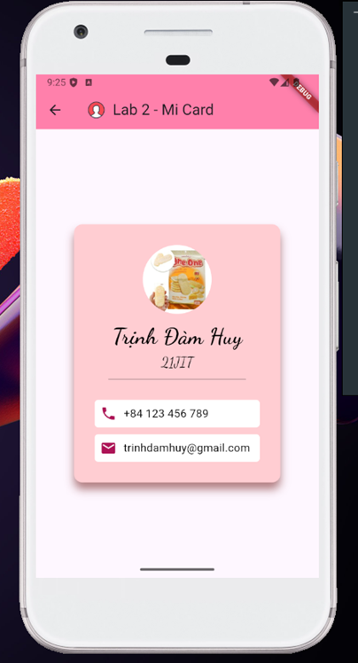

# Lab 2: MiCard

## Overview

This lab demonstrates a simple Flutter application called "MiCard".

## Expected Output

- A business card-like interface displaying personal information.
- The title "MiCard" displayed prominently.

## Additional Resources

- [Flutter Documentation](https://flutter.dev/docs)
- [Dart Documentation](https://dart.dev/guides)
