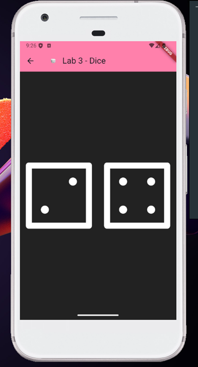

# Lab 3: Dice

## Overview

This lab demonstrates a simple Flutter application called "Dice".

## Expected Output

- The application will display the result of rolling two dices.
- Each dice will show a random number between 1 and 6.
- The numbers on the dices will change each time the user interacts with the app.

## Additional Resources

- [Flutter Documentation](https://flutter.dev/docs)
- [Dart Documentation](https://dart.dev/guides)
