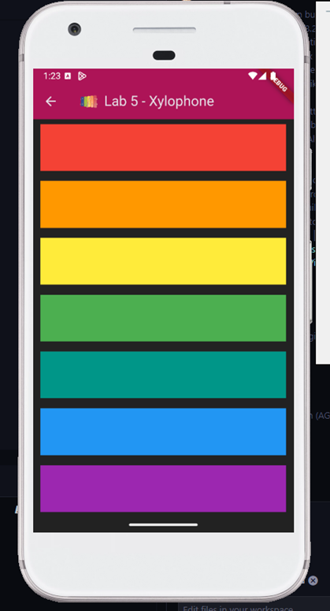

# Lab 5: Xylophone

## Overview

This lab demonstrates a simple Flutter application called "Xylophone".

## Expected Output

- The application will display a series of colored bars.
- Each bar will play a different musical note when tapped.

## Additional Resources

- [Flutter Documentation](https://flutter.dev/docs)
- [Dart Documentation](https://dart.dev/guides)
