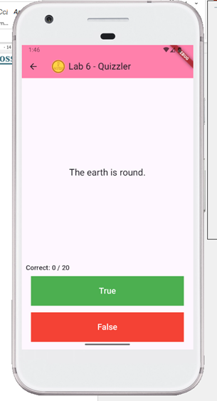
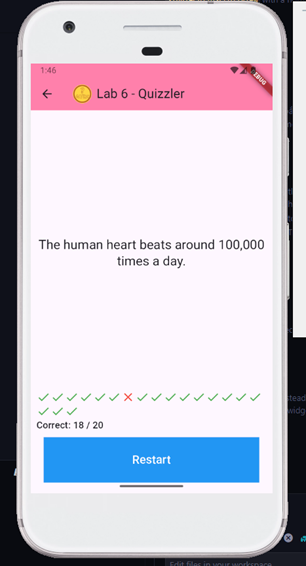

# Lab 6: Quizzler

## Overview

This lab demonstrates a simple Flutter application called "Quizzler".

## Expected Output

- A series of true/false questions displayed one at a time.
- Buttons for answering "True" or "False".
- A score display showing the number of correct answers out of the total number of questions.
- A "Restart" button displayed when the quiz is finished, allowing the user to restart the quiz.

## Additional Resources

- [Flutter Documentation](https://flutter.dev/docs)
- [Dart Documentation](https://dart.dev/guides)
